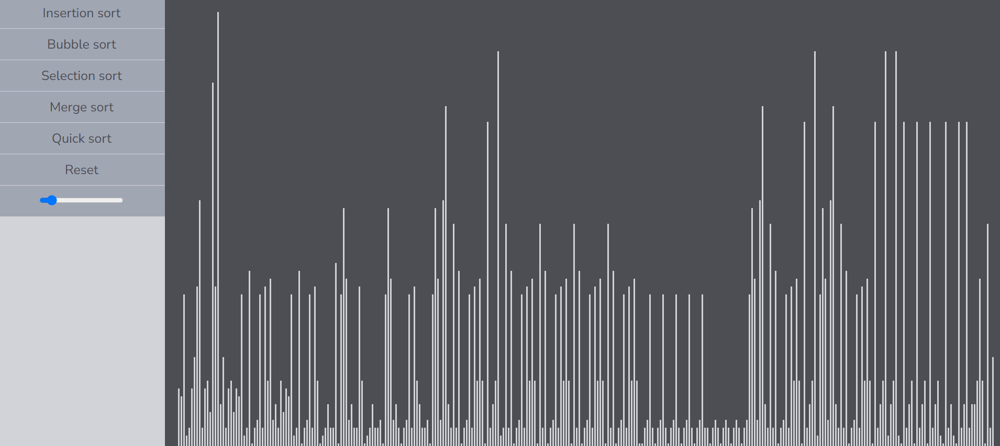
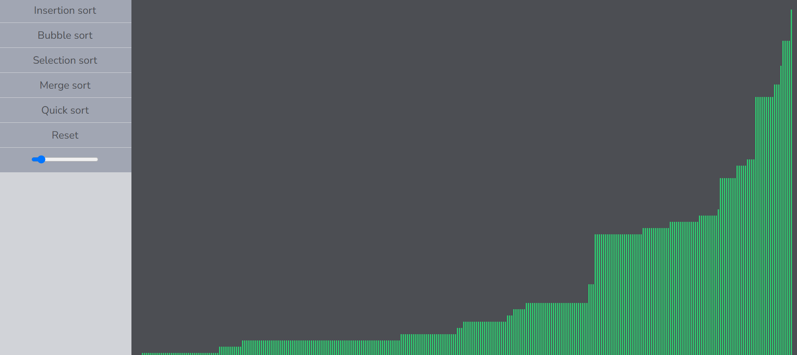
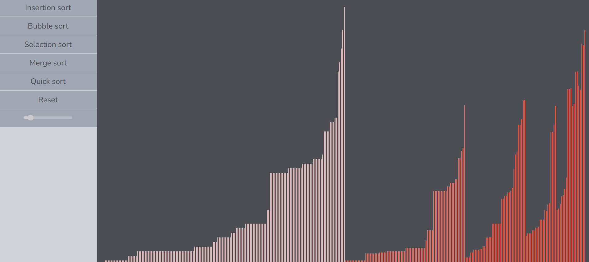

## Sorting Visualizer

- A sorting algorithm visualizer web application demonstrating insertion sort, bubble sort, selection sort, quick sort, and merge sort.

## Tech stack

- React JS, Typescript.

## Getting Started

### Prerequisites

- Node.js (v18+ recommended)
- npm or yarn

### Installation

```bash
git clone https://github.com/IsteakShupto/sorting-algos-visualizer/
cd sorting-algos-visualizer
npm install
```

## A brief detail about the project

- [Click here](https://www.linkedin.com/feed/update/urn:li:activity:7323577662751309824/)

## Features

- Smooth visual animations of sorting steps
- Supports multiple algorithms (Bubble, Merge, Quick, Insertion, Selection.)
- Speed control of animation
- Clean UI design

## Screenshots







## Details about the sorting algorithms

### Insertion sort

- In insertion sort, we basically iterate from second element of the array, treating left part as sorted. For every element, we shift all greater elements in the sorted part one position to the right and insert the current element at its correct position.

```ts
function insertionSort(): void {
  const newArr: number[] = [...arr];
  for (let i = 1; i < newArr.length; i++) {
    const curr = newArr[i];
    let j = i - 1;
    while (j >= 0 && newArr[j] > curr) {
      newArr[j + 1] = newArr[j];
      j--;
    }
    newArr[j + 1] = curr;
  }
}
```

### Selection sort

- In selection sort, for each position in the array, we find the minimum element in the unsorted portion and swap it with the current position. This ensures that with each pass, the smallest remaining element is placed in its correct position.

```ts
function selectionSort(): void {
  const newArr: number[] = [...arr];
  for (let i = 0; i < newArr.length - 1; i++) {
    let min_elem_idx: number = i;
    for (let j = i + 1; j < newArr.length; j++) {
      if (newArr[j] < newArr[min_elem_idx]) {
        min_elem_idx = j;
      }
    }
    const temp: number = newArr[min_elem_idx];
    newArr[min_elem_idx] = newArr[i];
    newArr[i] = temp;
  }
}
```

### Bubble sort

- In bubble sort, we continuously compare adjacent elements and swap them if they are in the wrong order. In worst possible case, we may need to do this n times for an array of length n to sort the array completely.

```ts
function bubbleSort(): void {
  const newArr: number[] = [...arr];
  for (let i = 0; i < newArr.length; i++) {
    for (let j = 0; j < newArr.length - 1; j++) {
      if (newArr[j] > newArr[j + 1]) {
        const temp: number = newArr[j];
        newArr[j] = newArr[j + 1];
        newArr[j + 1] = temp;
      }
    }
    if (isSwapped == false) {
      break;
    }
  }
}
```

### Merge sort

- In merge sort, it is divide-and-conquer algorithm that recursively splits the array into halves, sorts them, and merges them back in sorted order. The merging step compares elements from sorted halves and combines them into a single sorted array until the array is completely sorted.

```ts
function mergeArrays(
  arrCopy: number[],
  left: number,
  mid: number,
  right: number
): void {
  const newArr: number[] = [...arrCopy];
  const merged: number[] = [];
  let i: number = left;
  let j: number = mid + 1;
  while (i <= mid && j <= right) {
    if (newArr[i] < newArr[j]) {
      merged.push(newArr[i]);
      i++;
    } else {
      merged.push(newArr[j]);
      j++;
    }
  }
  while (i <= mid) {
    merged.push(newArr[i]);
    i++;
  }
  while (j <= right) {
    merged.push(newArr[j]);
    j++;
  }
  i = 0;
  for (let l = left; l <= right; l++) {
    arrCopy[l] = merged[i];
    i++;
  }
}

function mergeSort(arrCopy: number[], left: number, right: number): void {
  if (left >= right) return;
  const mid = Math.floor(left + (right - left) / 2);
  mergeSort(arrCopy, left, mid);
  mergeSort(arrCopy, mid + 1, right);
  mergeArrays(arrCopy, left, mid, right);
}
```

### Quick sort

- Quick sort is another divide-and-conquer algorithm, where recursively each time we choose a pivot, put all the elements less than it on left of it and put all the largest or equal of it on it's right and put the pivot in it's correct position. The process is recursively applied to the subarrays on either side of the pivot, and we continue it until the array is fully sorted.

```ts
function partition(arrCopy: number[], left: number, right: number): number {
  const pivot: number = arrCopy[right];
  const arrLeft: number[] = [];
  const arrRight: number[] = [];
  let count: number = 0;
  for (let i = left; i <= right - 1; i++) {
    if (arrCopy[i] < pivot) {
      arrLeft.push(arrCopy[i]);
      count++;
    } else {
      arrRight.push(arrCopy[i]);
    }
  }
  let j: number = 0;
  for (let i = left; i < left + count; i++) {
    arrCopy[i] = arrLeft[j];
    j++;
  }
  arrCopy[left + count] = pivot;
  j = 0;
  for (let i = left + count + 1; i <= right; i++) {
    arrCopy[i] = arrRight[j];
    j++;
  }

  return left + count;
}

function quickSort(arrCopy: number[], left: number, right: number): void {
  if (left < right) {
    const pivotIdx: number = partition(arrCopy, left, right);
    quickSort(arrCopy, left, pivotIdx - 1);
    quickSort(arrCopy, pivotIdx + 1, right);
  }
}
```
